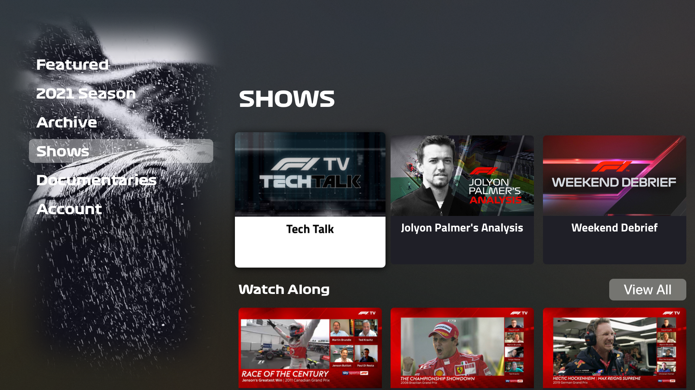
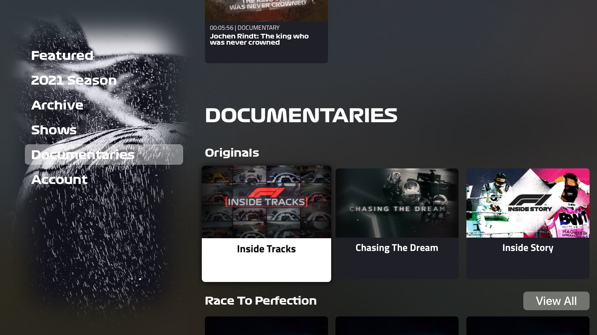
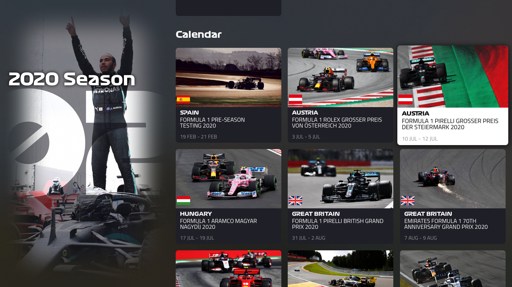
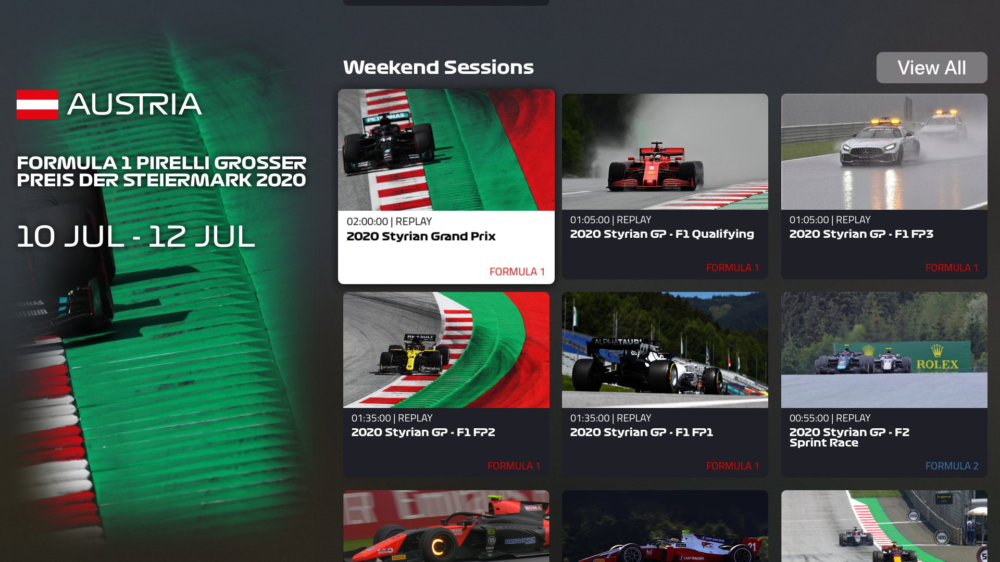
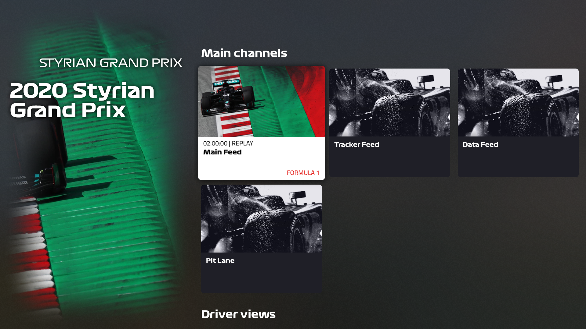
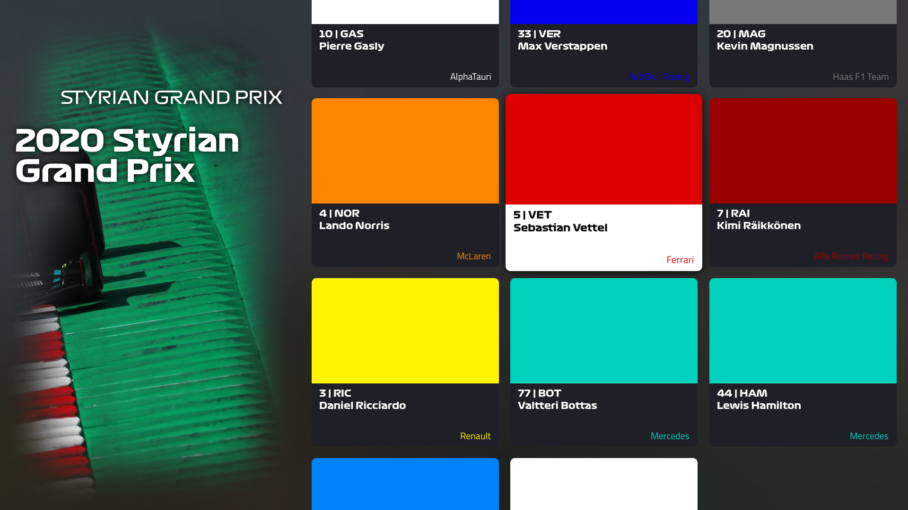

# F1A-TV
This app is unofficial and is not associated in any way with the Formula 1 companies. F1, FORMULA ONE, FORMULA 1, FIA FORMULA ONE WORLD CHAMPIONSHIP, GRAND PRIX and related marks are trade marks of Formula One Licensing B.V.

## Requirements

- Your AppleTV must be running tvOS 14.0 or higher

## Installation - TestFlight (Recommended)

- Go to the AppStore on your AppleTV & iPhone and search for "TestFlight" and install it
- Open this link with your iPhone and Accept the invite (https://testflight.apple.com/join/NRswe1IZ)
- Open TestFlight on your AppleTV and download the App from there

## Installation - Build it yourself

- Connect your AppleTV to Xcode (https://developer.apple.com/forums/thread/100785)
- Clone the Project and open the .xcworkspace file
- Select your personal team for code signing
- Select your AppleTV as run destination and run it
- Have fun :)

## Acknowledgements
* [RaceControl](https://github.com/robvdpol/RaceControl)  for deciphering the new API
* [SkeletonView](https://github.com/Juanpe/SkeletonView)
* [Kingfisher](https://github.com/onevcat/Kingfisher)
* [SPAlert](https://github.com/ivanvorobei/SPAlert)
* [TvOSSlider](https://github.com/zattoo/TvOSSlider)
* [F1TV](https://f1tv.formula1.com)

### If you like my work and feel the need to give something back, my programmer brain can always use some caffeine :)
[BuyMeACoffee](https://www.buymeacoffee.com/NoahFetz)

## Multi-Feed Player Tutorial

## Screenshots

