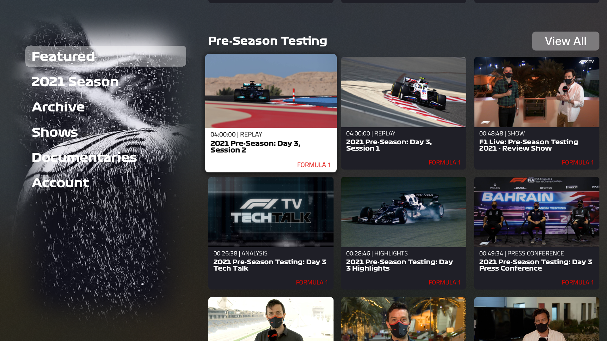
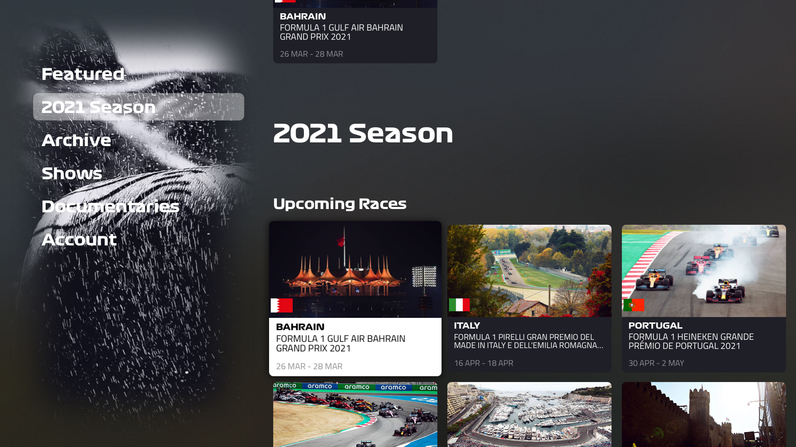
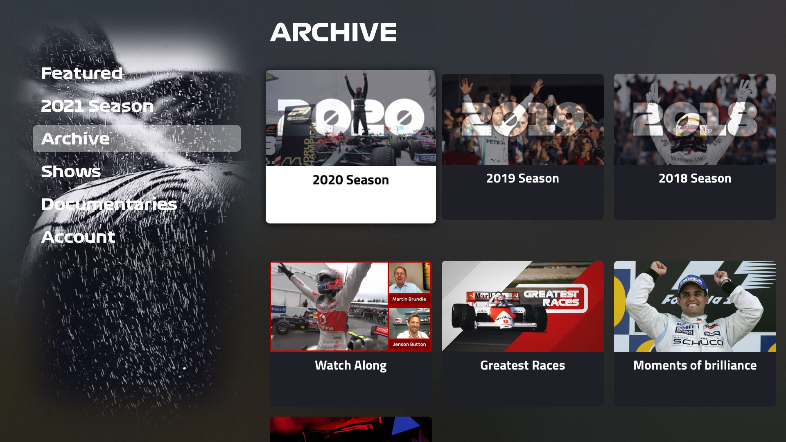

# F1TV

## Requirements

- Your AppleTV must be running tvOS 14.0 or higher
- You need a Mac running Xcode to install the app

## Installation

- Connect your AppleTV to Xcode (https://developer.apple.com/forums/thread/100785)
- Clone the Project and open it
- Select your personal team for code signing
- Select your AppleTV as run destination and run it
- Have fun :)

## Screenshots

