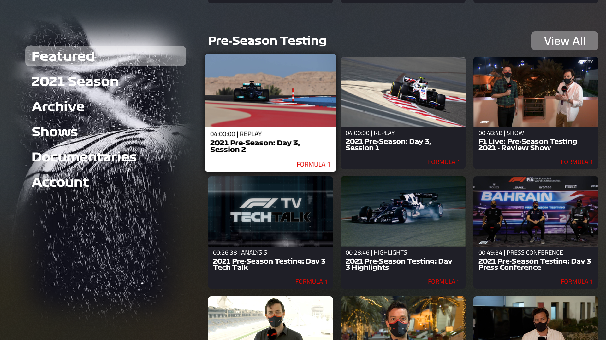
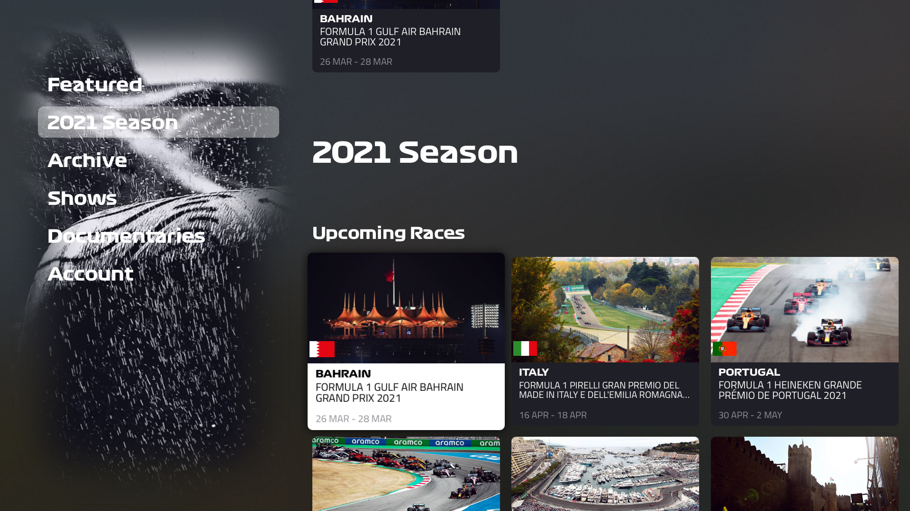
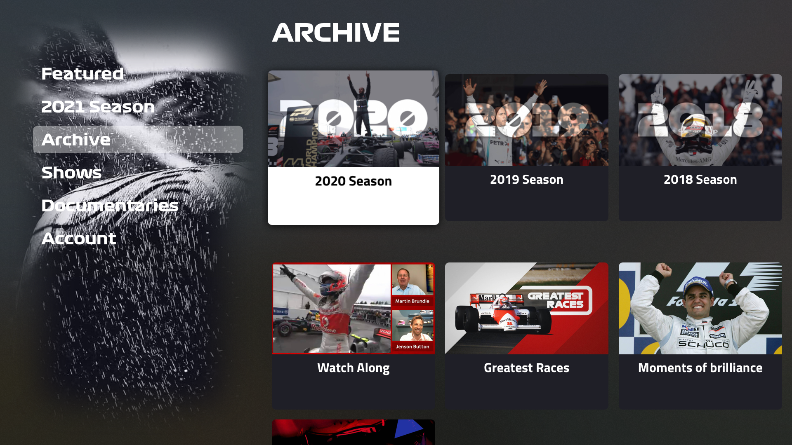
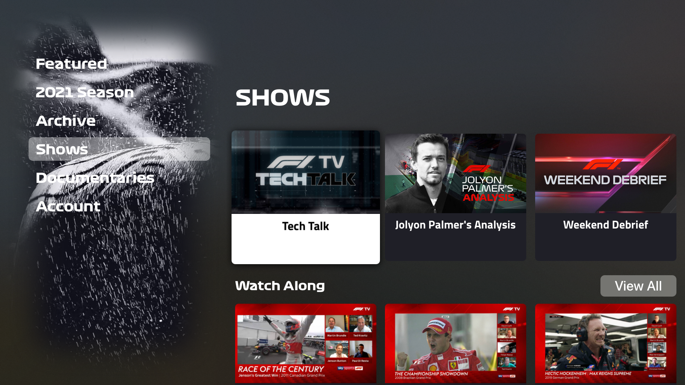
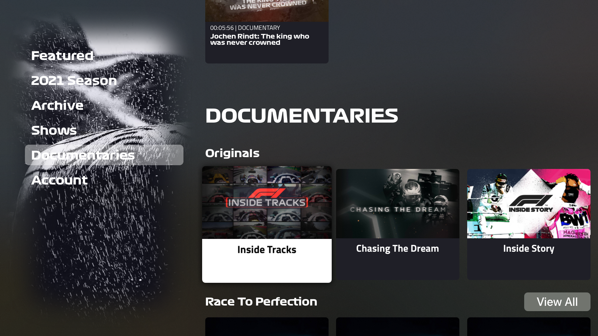
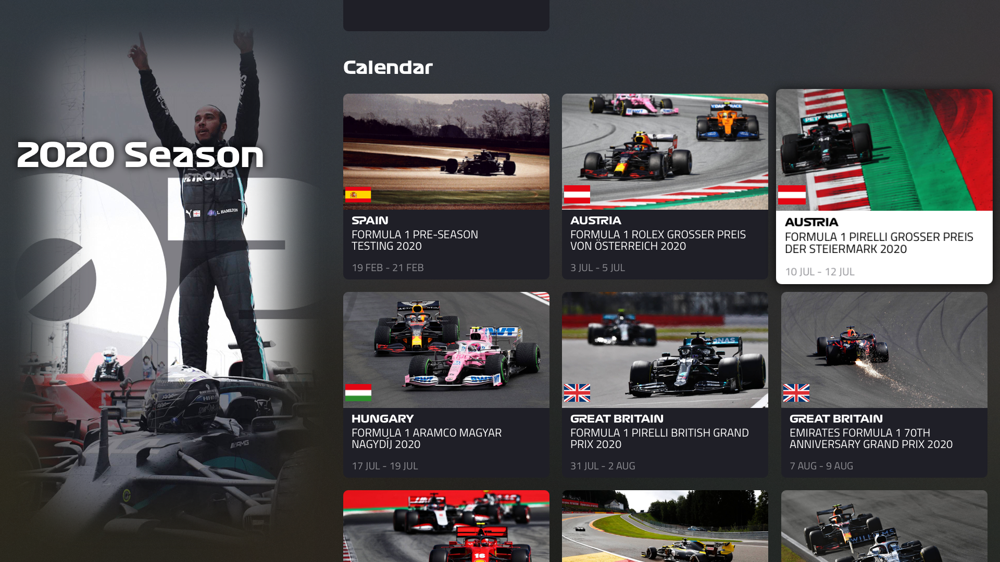
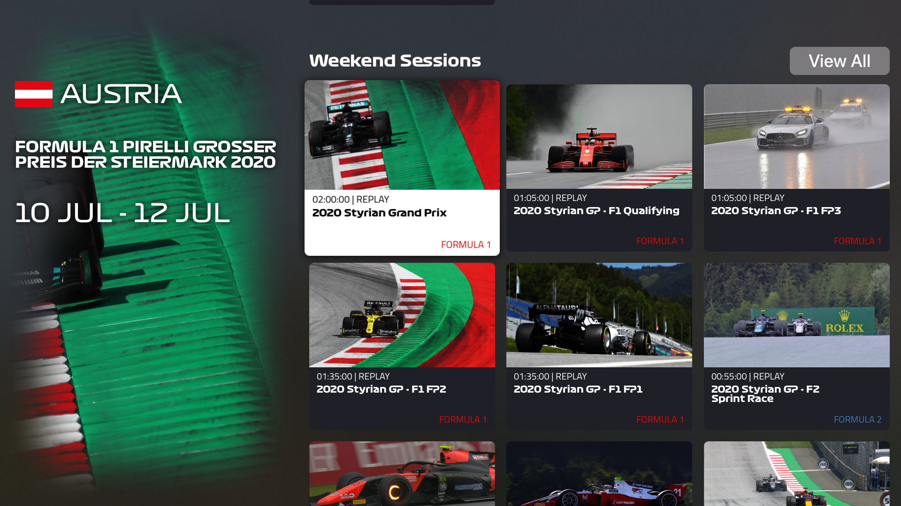
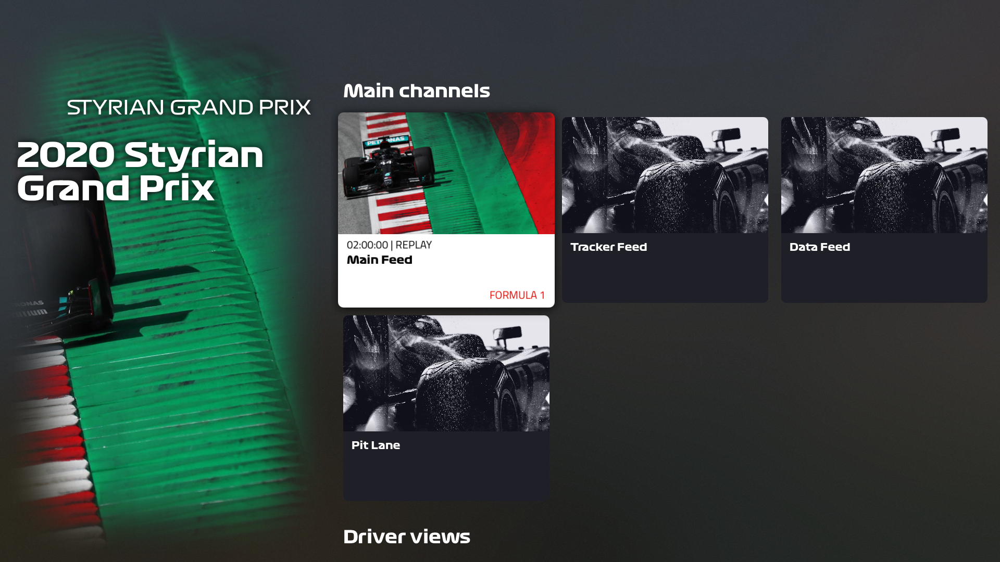
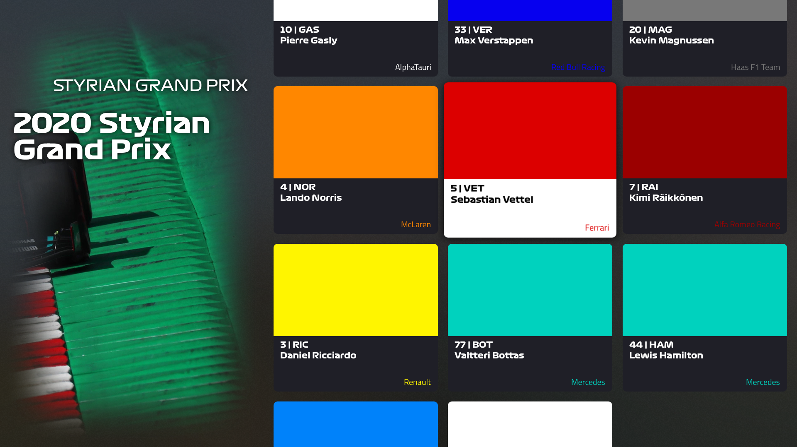

# F1A-TV

An unofficial F1 TV client for Apple TV, with race-weekend browsing and simultaneous feeds in a multiview player.

This app is unofficial and is not associated in any way with the Formula 1 companies. F1, FORMULA ONE, FORMULA 1, FIA FORMULA ONE WORLD CHAMPIONSHIP, GRAND PRIX and related marks are trade marks of Formula One Licensing B.V.

## Features

- Backend-driven navigation for Home, the current season, Archive, Shows and Documentaries, with additional series destinations when supplied by F1 TV.
- Featured carousels, poster and thumbnail rows, event backgrounds, and an interactive race-weekend schedule in your device's timezone.
- Multiview playback with feed selection and synchronized, muted stream previews.
- Startup quality, live-start, audio, caption and channel preferences in Settings.
- Account sign-in and a persistent local error history under Settings → Diagnostics → Error Log.

Search, My List and watch-history integration are not implemented. Playback requires an F1 TV account with access to the selected content; this app does not provide a subscription.

## Requirements

- An Apple TV meeting the app target's deployment setting, currently **tvOS 26.6 or later**. Older releases had different requirements.
- For source builds, a Mac with Xcode and a compatible tvOS SDK. The latest local builds used Xcode 27.2 beta 2.
- A physical Apple TV for DRM-protected playback. The tvOS Simulator can exercise browsing and unprotected media, but protected playback is unsupported.

Builds and fixture tests do not establish authenticated physical-device playback compatibility. Login, FairPlay playback, live behavior and concurrent-preview performance must also be checked on Apple TV.

## Installation with TestFlight

The [public TestFlight invitation](https://testflight.apple.com/join/NRswe1IZ) is open for new testers. Availability and the requirements of published builds may differ from the current source.

When the invitation is open, install TestFlight on your iPhone or iPad and Apple TV using the same App Store account, accept the invitation on the mobile device, then install F1A-TV through TestFlight on Apple TV.

## Build from source

1. Clone the repository and open **F1A-TV.xcodeproj** in Xcode.
2. Allow Xcode to resolve the Swift Package Manager dependencies. CocoaPods and a separate `.xcworkspace` are not required.
3. In the F1A-TV target's Signing & Capabilities settings, select your own development team. Change the bundle identifier if required for your signing setup.
4. Pair your Apple TV with Xcode, select it as the run destination, then build and run.
5. Open Account in the app to sign in.

For a simulator build without signing:

```sh
xcodebuild -project F1A-TV.xcodeproj -scheme F1A-TV \
  -destination 'generic/platform=tvOS Simulator' \
  CODE_SIGNING_ALLOWED=NO build
```

Unsigned builds can exercise browsing, but Keychain access may fail without the required signing entitlements. Use a signed run for account testing.

See the [test guide](Tests/README.md) for local checks and the [backend client guide](F1A-TV/Networking/README.md) for service architecture.

## Reporting problems

Include the app version, tvOS version, whether you used a simulator or physical Apple TV, the affected content and steps to reproduce. Error Log entries provide operation, timestamp and safe error codes; account credentials are stored in Keychain, and diagnostic history is local.

Do not attach passwords, account/device tokens, cookies, authorization headers, signed media/license URLs or raw network captures to public issues or commits. Backend account and entitlement fixtures must use synthetic values; public catalog fixtures must exclude user records and request credentials. Signing and upload credentials belong in local secure storage or GitHub Actions secrets.

## Acknowledgements

- [RaceControl](https://github.com/robvdpol/RaceControl) for deciphering the API
- [Alamofire](https://github.com/Alamofire/Alamofire)
- [SkeletonView](https://github.com/Juanpe/SkeletonView)
- [Kingfisher](https://github.com/onevcat/Kingfisher)
- [SPAlert](https://github.com/ivanvorobei/SPAlert)
- [TvOSSlider](https://github.com/zattoo/TvOSSlider)
- [F1 TV](https://f1tv.formula1.com)

If you'd like to support development, you can [buy me a coffee](https://www.buymeacoffee.com/NoahFetz).

## Earlier multifeed tutorial

This tutorial shows an older interface; the current navigation and controls have changed.

[](https://www.youtube.com/watch?v=hd6dtUYyWo4)

## Earlier screenshots

These screenshots document an older version and do not show the current browsing or settings interface.










